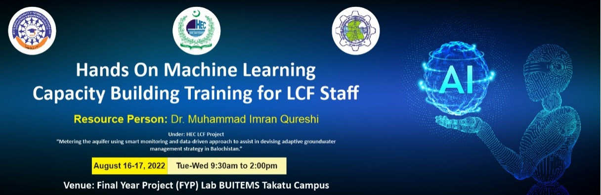

<h1 align="center" >  Hands-on Machine Learning: A Two-Days Capacity Building Workshop </h1>

    

This repository contains the lecture notes and Python Codes for a two-days workshop on Capacity Building Training on Machine Learning.

The contents, lecture notes, and Jupyter Notebooks for codes are listed below.

1. [Contents](https://github.com/ImranNust/TwoDaysMLCapacityBuildingWorkshop.git)
2. [An Introduction of Machine Learning](https://github.com/ImranNust/TwoDaysMLCapacityBuildingWorkshop/blob/main/Presentation2_IntroductionToML.mp4)
3. [Different Types of Machine Learning Algorithms](https://github.com/ImranNust/TwoDaysMLCapacityBuildingWorkshop/blob/main/Presentation3_TypesOfML.mp4)
4. [Unsupervised Machine Learning - K-Means Clustering](https://github.com/ImranNust/TwoDaysMLCapacityBuildingWorkshop/blob/main/Presentation4_k_meansClustering.mp4)
    - [Implementation of An Unspersived Machine Learning Algorithm Using Sklearn](https://github.com/ImranNust/TwoDaysMLCapacityBuildingWorkshop/blob/main/K_meansClustering.ipynb)
5. [Supervised Machine Learning - Linear Regression](https://github.com/ImranNust/TwoDaysMLCapacityBuildingWorkshop/blob/main/Presentation5_LinearRegression.mp4)
    - [Implementation of Supervised Machine Learning Algorithm - Linear Regression](https://github.com/ImranNust/TwoDaysMLCapacityBuildingWorkshop/blob/main/LinearRegression.ipynb)
6. [Supervised Machine Learning - Classification](https://github.com/ImranNust/TwoDaysMLCapacityBuildingWorkshop/blob/main/Presentation6_ImageClassification.mp4)
    - [Implementation of Supervised Machine Learning Algorithm using TensorFlow](https://github.com/ImranNust/TwoDaysMLCapacityBuildingWorkshop/blob/main/MNISTClassificationUsing.ipynb)
    - [Implementation of Convolutional Neural Network](https://github.com/ImranNust/TwoDaysMLCapacityBuildingWorkshop/blob/main/MNISTClassificationUsing.ipynb)
7. [Time Series Data Analysis and Forecasting](https://github.com/ImranNust/TwoDaysMLCapacityBuildingWorkshop/blob/main/Presentation7_TimeSeriesData.mp4)
    - [Components of a Time Series Data (Trend, Seasonality, Cyclic, and Irregularity) and how to find them using Python](https://github.com/ImranNust/TwoDaysMLCapacityBuildingWorkshop/blob/main/ComponentsOfTimeSeriesAnalysis.ipynb)
    - [Stationary and Non-stationary Time Series Data and Implementation Using Python](https://github.com/ImranNust/TwoDaysMLCapacityBuildingWorkshop/blob/main/StationaryNonStationaryCheck.ipynb)
    - [Coversion of a Non-stationary to Stationary Time Series Data](https://github.com/ImranNust/TwoDaysMLCapacityBuildingWorkshop/blob/main/ConversionStationaryNonStationary.ipynb)
8. [Univariate and Multi-Variate Time Series Analysis and Forecasting Using ARIMA, SARIMA, and VAR](https://github.com/ImranNust/TwoDaysMLCapacityBuildingWorkshop/blob/main/Presentation8_UnivariateTimeSeriesForecasting%20%20.pptx)
    - [Univariate Time Series Forecasting using ARIMA](https://github.com/ImranNust/TwoDaysMLCapacityBuildingWorkshop/blob/main/ARIMA.ipynb)
    - [Univariate Time Series Forecasting using SARIMA](https://github.com/ImranNust/TwoDaysMLCapacityBuildingWorkshop/blob/main/ARIMA.ipynb)
    - [Multivariate Time Series Forecasting using VAR](https://github.com/ImranNust/TwoDaysMLCapacityBuildingWorkshop/blob/main/VAR.ipynb)

To prepare the notes and coding examples, following refences were used:

1. [Everything You Need to Know About Time Series Analysis – A Primer](https://www.expressanalytics.com/blog/time-series-analysis/)
2. [A Comprehensive Guide to Time Series Analysis](https://www.analyticsvidhya.com/blog/2021/10/a-comprehensive-guide-to-time-series-analysis/)
3. [Understanding Time Series Analysis in Python](https://www.simplilearn.com/tutorials/python-tutorial/time-series-analysis-in-python)
4. [A Guide to Time Series Analysis in Python](https://builtin.com/data-science/time-series-python)
5. [Time Series Analysis in Python – A Comprehensive Guide with Examples](https://www.machinelearningplus.com/time-series/time-series-analysis-python/)
6. [Complete Guide on Time Series Analysis in Python](https://www.kaggle.com/code/prashant111/complete-guide-on-time-series-analysis-in-python/notebook)
7. [Topic 9. Part 1. Time series analysis in Python](https://www.kaggle.com/code/kashnitsky/topic-9-part-1-time-series-analysis-in-python)
8. [Time Series Forecast : A basic introduction using Python.](https://medium.com/@stallonejacob/time-series-forecast-a-basic-introduction-using-python-414fcb963000)
9. [An End-to-End Project on Time Series Analysis and Forecasting with Python](https://towardsdatascience.com/an-end-to-end-project-on-time-series-analysis-and-forecasting-with-python-4835e6bf050b)
10. [Time Series Analysis in Python: An Introduction](https://towardsdatascience.com/time-series-analysis-in-python-an-introduction-70d5a5b1d52a)
11. [A Comprehensive Guide to Time Series Analysis in Python](https://www.turing.com/kb/comprehensive-guide-to-time-series-analysis-in-Python)
12. [Finding Seasonal Trends in Time-Series Data with Python](https://towardsdatascience.com/finding-seasonal-trends-in-time-series-data-with-python-ce10c37aa861)
13. [Univariate Time Series Analysis and Forecasting with ARIMA/SARIMA](https://www.section.io/engineering-education/univariate-time-series-analysis-with-arima-in-python/)
14. [ARIMA Model – Complete Guide to Time Series Forecasting in Python](https://www.machinelearningplus.com/time-series/arima-model-time-series-forecasting-python/)
15. [Hands-On Tutorial on Vector AutoRegression(VAR) For Time Series Modeling](https://analyticsindiamag.com/hands-on-tutorial-on-vector-autoregressionvar-for-time-series-modeling/)
16. [Vector Autoregression (VAR) – Comprehensive Guide with Examples in Python](https://www.machinelearningplus.com/time-series/vector-autoregression-examples-python/)

